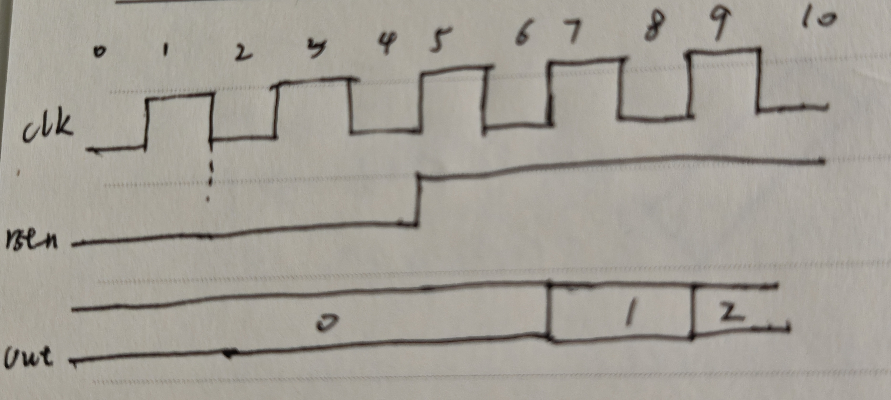

## 开发环境

- Yosys: v0.33。使用sudo apt install yosys安装。
- cvc5：v1.1.2。使用pysmt-install --cvc5安装。
- PySMT：v0.9.6。
- Python 3.12.3。
- Ubuntu 20.04。

## 使用

### 运行命令

```bash
python main.py xxx.v top_module_name testbench_file [-k step]
```

xxx.v为待测Verilog代码。

top_module_name为Verilog代码中顶层模块名称。

testbench_file为自定义testbench文件。

-k为BMC最大展开步数，默认为20。

### 示例

1. 在dut文件夹下创建待测模块

   ```verilog
   // counter.v
   module counter(
     input clk,
     input rst_n, // 低电平有效复位
     input [3:0] initval, // (在这个测试中未使用)
     output reg [3:0] out
   );
   
     initial out = 'd0;
   
     always @(posedge clk) begin
       if (rst_n == 1'b0) begin
         out <= 4'b0000;
       end else begin
         out <= out + 1;
       end
     end
   
   endmodule
   ```

2. 在tb文件夹下创建testbench

   ```txt
   ; test01.txt
   [CLOCK]
   clk = 1
   
   [PROPERTY]
   out == 2
   
   [PROCESS]
   ; 1. 启动时，保持复位状态
   initval = 0
   rst_n = 0
   
   ; 2. 保持复位 5 个时钟周期 (#5 意味着持续 5 步, k=0 到 k=4)
   #5
   
   ; 3. 在第 5 步 (k=5) 时，释放复位
   rst_n = 1
   ```

   testbench使用自定义格式，主要包含了3部分。

   - **[CLOCK]**：定义时钟周期，例如clk = 2，表示占空比为50%的时钟，每2个step电平翻转。
   - **[PROPERTY]**：不变量/属性，例如out == 2表示，我们要检查它是否能在k步内达到 2。目前支持`==,!=,<,<=,>,>=`操作符。
   - **[PROCESS]**：输入信号控制流程，内部只有两种语法：
     - 阻塞赋值:symbol = val。
     - 延时:#n,n的单位为step。

3. 在工程根目录下运行：

   ```bash
   python main.py dut/counter.v counter tb/test01.txt -k 10
   ```

   运行结果如下：

   ```txt
   --- 正在执行 Yosys 转换 ---
   命令: yosys -p "read_verilog -nomem2reg -sv /home/lvt/Verilog_MBC/proj/dut/counter.v; prep -top counter; hierarchy -check; memory -nomap; flatten;; clk2fflogic;; setundef -undriven -anyseq; write_btor /home/lvt/Verilog_MBC/proj/dut/counter.btor2"
   --- 转换完成，BTOR2文件生成: dut/counter.btor2 ---
   --- 解析 BTOR2 文件: dut/counter.btor2 ---
   
   --- 解析结果摘要 ---
   状态变量: ['state_9', 'state_12', 'state_7']
   输入变量: ['clk', 'initval', 'rst_n']
   初始状态: ((state_7 = 0_4) & (state_9 = 0_4) & (state_12 = 1_1))
   不变量: (out = ((((state_12::clk) bvcomp 1_2) = 1_1) ? state_9 : state_7))
   转换关系:
     state_7 -> ((((state_12::clk) bvcomp 1_2) = 1_1) ? state_9 : state_7)
     state_9 -> ((rst_n = 1_1) ? (((((state_12::clk) bvcomp 1_2) = 1_1) ? state_9 : state_7) + (1_1 ZEXT 3)) : 0_4)
     state_12 -> clk
   -----------------
   
   加载属性: out == 2
   加载了 2 个 process 段。
   加载了时钟: {'clk': 1}
   --- 开始 BMC (K_max = 10) ---
   正在检查步骤 K = 0 (段 0, 段内步数 0)
   正在检查步骤 K = 1 (段 0, 段内步数 1)
   正在检查步骤 K = 2 (段 0, 段内步数 2)
   正在检查步骤 K = 3 (段 0, 段内步数 3)
   正在检查步骤 K = 4 (段 0, 段内步数 4)
   正在检查步骤 K = 5 (段 1, 段内步数 0)
   正在检查步骤 K = 6 (段 1, 段内步数 1)
   正在检查步骤 K = 7 (段 1, 段内步数 2)
   正在检查步骤 K = 8 (段 1, 段内步数 3)
   正在检查步骤 K = 9 (段 1, 段内步数 4)
   
   !!! 属性 'out == 2' 在步骤 9 变为 TRUE !!!
   
   --- 反例信息 ---
     --- 步骤 0 ---
       clk: 0_1
       initval: 0_4
       rst_n: 0_1
       state_7: 0_4
       state_9: 0_4
       state_12: 1_1
       out: 0_4
     --- 步骤 1 ---
       clk: 1_1
       initval: 0_4
       rst_n: 0_1
       state_7: 0_4
       state_9: 0_4
       state_12: 0_1
       out: 0_4
     --- 步骤 2 ---
       clk: 0_1
       initval: 0_4
       rst_n: 0_1
       state_7: 0_4
       state_9: 0_4
       state_12: 1_1
       out: 0_4
     --- 步骤 3 ---
       clk: 1_1
       initval: 0_4
       rst_n: 0_1
       state_7: 0_4
       state_9: 0_4
       state_12: 0_1
       out: 0_4
     --- 步骤 4 ---
       clk: 0_1
       initval: 0_4
       rst_n: 0_1
       state_7: 0_4
       state_9: 0_4
       state_12: 1_1
       out: 0_4
     --- 步骤 5 ---
       clk: 1_1
       initval: 0_4
       rst_n: 1_1
       state_7: 0_4
       state_9: 0_4
       state_12: 0_1
       out: 0_4
     --- 步骤 6 ---
       clk: 0_1
       initval: 0_4
       rst_n: 1_1
       state_7: 0_4
       state_9: 1_4
       state_12: 1_1
       out: 0_4
     --- 步骤 7 ---
       clk: 1_1
       initval: 0_4
       rst_n: 1_1
       state_7: 0_4
       state_9: 1_4
       state_12: 0_1
       out: 1_4
     --- 步骤 8 ---
       clk: 0_1
       initval: 0_4
       rst_n: 1_1
       state_7: 1_4
       state_9: 2_4
       state_12: 1_1
       out: 1_4
     --- 步骤 9 ---
       clk: 1_1
       initval: 0_4
       rst_n: 1_1
       state_7: 1_4
       state_9: 2_4
       state_12: 0_1
       out: 2_4
   -----------------
   ```

   运行流程示意图：

   